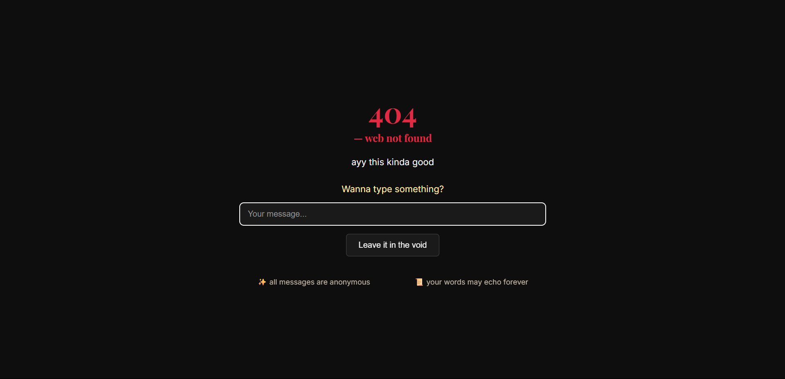

# 🌌 Void Messages — 404 Web Not Found

> A poetic space to leave anonymous thoughts in the void. No names. No likes. Just one message echoed into the digital unknown.



---

## 🧠 What is this?

"Void Messages" is a minimalist 404-style web app where anyone can submit a short message anonymously. A random message is displayed each time the page loads—sometimes it's yours, sometimes it's someone else's.

---

## ✨ Features

- 💬 Leave a message (max 200 characters)
- 🎲 Displays one random message on every load
- 🔒 All messages are anonymous
- 🎨 Dark and poetic aesthetic
- ⚡ Built with Node.js, Express, and MongoDB

---

## 🔧 Tech Stack

- **Frontend**: HTML, CSS, JavaScript
- **Backend**: Node.js, Express
- **Database**: MongoDB (via Mongoose)

---

## 🚀 Getting Started

### Prerequisites
- Node.js v18+ recommended
- MongoDB running locally (or use MongoDB Atlas)

### Installation

```bash
git clone https://github.com/your-username/void-messages.git
cd void-messages
npm install
